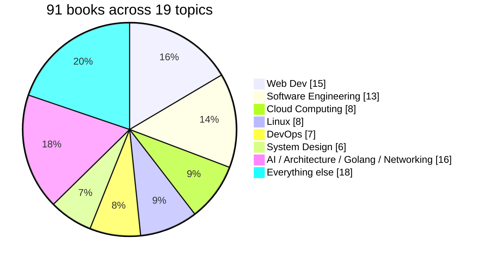

<a id="top"></a>

<div align="center">


<br/>


### 📚 A single, well-organized home for the books behind a solid CS education

*From theory and architecture to modern web development and system design.*

<br/>

[🚀 Start Here](#-start-here) · [🧭 Reading Paths](#-reading-paths) · [⭐ Editor's Picks](#-editors-picks) · [📊 At a Glance](#-collection-at-a-glance) · [🗂️ Browse](#-browse-the-shelves) · [🤝 Contribute](#-contributing)

</div>

---

## 📖 About

This repository is a personal library of Computer Science reference books, textbooks, and guides, sorted into topic folders so anything can be found in seconds. It spans core CS theory, systems programming, languages, cloud & DevOps, and modern software engineering practice.

> [!NOTE]
> These books are shared for personal, educational use. Please support the authors and publishers by purchasing their work where possible.

---

## 🚀 Start Here

**Not sure where to begin?** Pick the goal that sounds most like yours:

| I want to... | Go to |
|---|---|
| 🌐 Build modern web apps | [Full-Stack Web path](#-reading-paths) |
| ⚙️ Understand how computers *really* work | [Systems path](#-reading-paths) |
| ☁️ Ship and run software at scale | [Cloud & DevOps path](#-reading-paths) |
| 🎯 Prepare for interviews | [Interview Prep path](#-reading-paths) |
| 🧠 Get into AI / ML | [AI path](#-reading-paths) |
| 🌱 Become a better engineer | [Craft path](#-reading-paths) |

### 💡 Grab just one topic (without cloning everything)

A library of PDFs gets heavy fast. Use a sparse checkout to pull only the shelves you need:

```bash
git clone --filter=blob:none --sparse <this-repo-url>
cd <repo-name>
git sparse-checkout set "Web Dev" "System Design"
```

Or just open any book below and hit **Download raw file** on GitHub.

---

## 🧭 Reading Paths

Suggested orders, from foundations to advanced. Every title links straight to the PDF.

<details open>
<summary><b>🌐 Full-Stack Web</b></summary>

1. [Eloquent JavaScript](<./Web Dev/Eloquent_JavaScript_3rdEdition.pdf>)
2. [Learning TypeScript](<./Web Dev/Learning TypeScript.pdf>)
3. [The Road to React](<./Web Dev/Robin Wieruch - The Road to React.pdf>)
4. [Web Development with Node & Express](<./Web Dev/Web_Development_with_Node_Express.pdf>)
5. [Mastering API Architecture](<./Web Dev/mastering-api-architecture.pdf>)
6. [Designing Data-Intensive Applications](<./Software Engineering/designing-data-intensive-applications-the-big-ideas-behind-reliable-scalable-and-maintainable-systems-2_compress.pdf>)

</details>

<details>
<summary><b>⚙️ Systems & Low-Level</b></summary>

1. [The C Book](./C/C-book.pdf)
2. [The Linux Command Line](<./LINUX/The Linux CommandLine.pdf>)
3. [Operating System Concepts (9th Ed.)](<./OS/Abraham Silberschatz-Operating System Concepts (9th,2012_12).pdf>)
4. [The Linux Programming Interface](<./LINUX/The Linux Programming Interface.pdf>)
5. [Computer Architecture: A Quantitative Approach](<./Architecture/Computer Architecture, Sixth Edition_ A Quantitative Approach ( PDFDrive ).pdf>)
6. [Compilers: Principles, Techniques, and Tools](<./Compiler/Aho - Compilers - Principles, Techniques, and Tools 2e-1.pdf>)

</details>

<details>
<summary><b>☁️ Cloud & DevOps</b></summary>

1. [The Linux DevOps Handbook](<./DevOps/The Linux DevOps Handbook.pdf>)
2. [The DevOps Handbook](<./DevOps/The DevOps Handbook.pdf>)
3. [Site Reliability Engineering](<./DevOps/Site Reliability Engineering.pdf>)
4. [Amazon Web Services in Action](<./Cloud Computing/Amazon Web Services in Action.pdf>)
5. [Hands-On Microservices with Kubernetes](<./System Design/Hands On Microservices With Kubernetes - Build deploy and manage scalable microservices on-kubernetes.pdf>)
6. [Designing Distributed Systems](<./Software Engineering/designing-distributed-systems-patterns-and-paradigms-for-scalable-reliable-services-first-edition.pdf>)

</details>

<details>
<summary><b>🎯 Interview Prep</b></summary>

1. [Cracking the Coding Interview (6th Ed.)](<./System Design/Cracking-the-Coding-Interview-6th-Edition-189-Programming-Questions-and-Solutions.pdf>)
2. [Algorithms — Illustrated](<./Software Engineering/Algorithms - Illustrated Programmers Curious.pdf>)
3. [System Design Interview — Alex Xu](<./System Design/10-1 System Design Inteview by Alex xu.pdf>)
4. [System Design Interview, Vol. 2](<./System Design/10-2 System_Design_Interview Guides_Alex_Xu_Vol2.pdf>)
5. [ByteByteGo: Big Archive of System Design](<./System Design/10-3 Bytebytego_Big_Archive_System_Design_2023.pdf>)
6. [Designing Data-Intensive Applications](<./Software Engineering/designing-data-intensive-applications-the-big-ideas-behind-reliable-scalable-and-maintainable-systems-2_compress.pdf>)

</details>

<details>
<summary><b>🧠 AI & Machine Learning</b></summary>

1. [Learning Python](./Python/Learning_Python.pdf)
2. [Python for Data Analysis](<./Python/Python-for-Data-Analysis.pdf>)
3. [Machine Learning Book](<./AI/Machine Learning book.pdf>)
4. [Deep Learning](<./AI/Deep Learning Adaptive Computation and Machine Learning.pdf>)
5. [AI Engineering](<./AI/AI Engineering.pdf>)

</details>

<details>
<summary><b>🌱 Engineering Craft</b></summary>

1. [Think Like a Programmer](<./Software Engineering/Think Like a Programmer - An Introduction to Creative Problem Solving.pdf>)
2. [The Pragmatic Programmer](<./Software Engineering/The Pragmatic Programmer Your Journey to Mastery, 20th Anniversary Edition by Andrew Hunt David Hurst Thomas.pdf>)
3. [Clean Code](<./Software Engineering/Clean Code A Handbook of Agile Software Craftsmanship.pdf>)
4. [Code Complete](<./Software Engineering/Code Complete.pdf>)
5. [Software Engineering at Google](<./Software Engineering/software-engineering-at-google-lessons-learned-from-programming-over-time-1nbsped-1492082791-9781492082798_compress.pdf>)
6. [The Staff Engineer's Path](<./Software Engineering/The Staff Engineer’s Path -- Tanya Reilly.pdf>)

</details>

---

## ⭐ Editor's Picks

If you only read a handful, make it these:

| Book | Why it earns a spot |
|---|---|
| [The Pragmatic Programmer](<./Software Engineering/The Pragmatic Programmer Your Journey to Mastery, 20th Anniversary Edition by Andrew Hunt David Hurst Thomas.pdf>) | Timeless habits and mindset for working developers |
| [Designing Data-Intensive Applications](<./Software Engineering/designing-data-intensive-applications-the-big-ideas-behind-reliable-scalable-and-maintainable-systems-2_compress.pdf>) | The clearest tour of how modern data systems actually work |
| [Site Reliability Engineering](<./DevOps/Site Reliability Engineering.pdf>) | How Google keeps big systems running |
| [The Linux Programming Interface](<./LINUX/The Linux Programming Interface.pdf>) | The definitive reference for Linux/UNIX system programming |
| [Effective Java](<./JAVA/Effective Java.pdf>) | Best-practice Java, one crisp lesson at a time |
| [Operating System Concepts](<./OS/Abraham Silberschatz-Operating System Concepts (9th,2012_12).pdf>) | The classic OS textbook, still the standard |

---

## 📊 Collection at a Glance



| Topic | Shelf | Books |
|---|---|:---:|
| 🕸️ Web Dev | ▰▰▰▰▰▰▰▰▰▰▰▰▰▰▰ | **15** |
| 🛠️ Software Engineering | ▰▰▰▰▰▰▰▰▰▰▰▰▰ | **13** |
| ☁️ Cloud Computing | ▰▰▰▰▰▰▰▰ | **8** |
| 🐧 Linux | ▰▰▰▰▰▰▰▰ | **8** |
| 🔁 DevOps | ▰▰▰▰▰▰▰ | **7** |
| 🏗️ System Design | ▰▰▰▰▰▰ | **6** |
| 🤖 AI · 🏛️ Architecture · 🐹 Golang · 🌐 Networking | ▰▰▰▰ | **4** each |
| 🔐 Cryptography · 🐍 Python | ▰▰▰ | **3** each |
| 🔤 C · 🗄️ DBMS · ☕ Java · 🖥️ OS · ➗ Discrete Math | ▰▰ | **2** each |
| ⚙️ Compiler · 🦀 Rust | ▰ | **1** each |

<sub>Each ▰ ≈ 1 book. Web Dev and Software Engineering are, unsurprisingly, where the shelf sags the most.</sub>

---

## 🗂️ Browse the Shelves

<div align="center">

[🤖 AI](#ai) · [🏛️ Architecture](#architecture) · [🔤 C](#c) · [🔐 Cryptography](#cryptography) · [☁️ Cloud](#cloud-computing) · [⚙️ Compiler](#compiler) · [🗄️ DBMS](#dbms)
<br/>
[🔁 DevOps](#devops) · [➗ Discrete Math](#discrete-mathematics) · [🐹 Golang](#golang) · [☕ Java](#java) · [🐧 Linux](#linux) · [🌐 Networking](#networking)
<br/>
[🖥️ OS](#os) · [🐍 Python](#python) · [🦀 Rust](#rust) · [🛠️ Software Eng.](#software-engineering) · [🏗️ System Design](#system-design) · [🕸️ Web Dev](#web-dev)

</div>

<a id="ai"></a>
### 🤖 AI <sub>· 4 books</sub>

- [AI Engineering](./AI/AI%20Engineering.pdf)
- [Artificial Intelligence For Dummies](./AI/Artificial%20Intelligence%20For%20Dummies.pdf)
- [Deep Learning (Adaptive Computation and Machine Learning)](./AI/Deep%20Learning%20Adaptive%20Computation%20and%20Machine%20Learning.pdf)
- [Machine Learning Book](./AI/Machine%20Learning%20book.pdf)

<sub><a href="#top">⬆ back to top</a></sub>

<a id="architecture"></a>
### 🏛️ Architecture <sub>· 4 books</sub>

- [Advanced Computer Architecture: Parallelism](./Architecture/ADVANCED_COMPUTER_ARCHITECTURE_PARALLELI.pdf)
- [Computer Architecture, 6th Edition — A Quantitative Approach](<./Architecture/Computer Architecture, Sixth Edition_ A Quantitative Approach ( PDFDrive ).pdf>)
- [Computer Architecture — Hwang & Briggs](./Architecture/Computer_architecture_hwang_brigg.pdf)
- [Computer System Architecture — M. Morris Mano](./Architecture/mano-m-m-computer-system-architecture.pdf)

<sub><a href="#top">⬆ back to top</a></sub>

<a id="c"></a>
### 🔤 C <sub>· 2 books</sub>

- [The C Book](./C/C-book.pdf)
- [Programming in ANSI C — E. Balagurusamy](<./C/Programming in ANSI C (E Balagurusamy).pdf>)

<sub><a href="#top">⬆ back to top</a></sub>

<a id="cryptography"></a>
### 🔐 Cryptography <sub>· 3 books</sub>

- [Cryptography and Network Security — Atul Kahate](./CRYPTOGRAPHY/Atul_kahate.pdf)
- [Cryptography and Network Security — Forouzan](./CRYPTOGRAPHY/Forouzan.pdf)
- [Cryptography and Network Security — William Stallings](./CRYPTOGRAPHY/WilliamStallings.pdf)

<sub><a href="#top">⬆ back to top</a></sub>

<a id="cloud-computing"></a>
### ☁️ Cloud Computing <sub>· 8 books</sub>

- [Amazon Web Services in Action](<./Cloud Computing/Amazon Web Services in Action.pdf>)
- [Cloud Computing: Principles and Paradigms](<./Cloud Computing/CLOUD COMPUTING Principles and Paradigms.pdf>)
- [Cloud Computing: Concepts, Technology, Security, and Architecture](<./Cloud Computing/Cloud Computing_ Concepts, Technology, Security, and Architecture (The Pearson Digital Enterprise...{Thomas Erl, Eric Monroy}(2023, Pearson).pdf>)
- [Cloud Computing: Theory and Practice](<./Cloud Computing/Cloud-Computing-Theory-and-Practice.pdf>)
- [Handbook of Cloud Computing](<./Cloud Computing/Handbook_of_Cloud_Computing.pdf>)
- [Mastering Cloud Computing — Foundations and Applications Programming (Rajkumar Buyya, 2nd Ed.)](<./Cloud Computing/Mastering Cloud Computing Foundations and Applications Programming (Rajkumar Buyya)_2nd_Edition.pdf>)
- [Cloud Computing for Dummies (2nd Ed.)](<./Cloud Computing/cloud-computing-for-dummies-2ed_compress.pdf>)
- [The Self-Taught Cloud Computing Engineer](<./Cloud Computing/the-self-taught-cloud-computing-engineer.pdf>)

<sub><a href="#top">⬆ back to top</a></sub>

<a id="compiler"></a>
### ⚙️ Compiler <sub>· 1 book</sub>

- [Compilers: Principles, Techniques, and Tools (2nd Ed.) — Aho](<./Compiler/Aho - Compilers - Principles, Techniques, and Tools 2e-1.pdf>)

<sub><a href="#top">⬆ back to top</a></sub>

<a id="dbms"></a>
### 🗄️ DBMS <sub>· 2 books</sub>

- [Fundamentals of Database Systems](<./DBMS/Fundamentals of Database Systems.pdf>)
- [Database Systems: A Practical Approach to Design, Implementation and Management (6th Global Ed.)](<./DBMS/Pearson.Database.Systems.A.Practical.Approach.to.Design.Implementation.and.Management.6th.Global.Edition.pdf>)

<sub><a href="#top">⬆ back to top</a></sub>

<a id="devops"></a>
### 🔁 DevOps <sub>· 7 books</sub>

- [Accelerate — Building and Scaling High Performing Technology Organisations](<./DevOps/Accelerate - Building and Scaling High Performing Technology Organisations - Nicole Fergrson.pdf>)
- [Site Reliability Engineering](<./DevOps/Site Reliability Engineering.pdf>)
- [The DevOps Engineer's Career Guide](<./DevOps/The DevOps Engineer’s Career Guide A Handbook for Entry- Level Professionals to get into Continuous Delivery Roles for Agile... (Stephen Fleming).pdf>)
- [The DevOps Handbook](<./DevOps/The DevOps Handbook.pdf>)
- [The Linux DevOps Handbook](<./DevOps/The Linux DevOps Handbook.pdf>)
- [The Phoenix Project](<./DevOps/The Phoenix Project.pdf>)
- [The Unicorn Project](<./DevOps/The Unicorn Project.pdf>)

<sub><a href="#top">⬆ back to top</a></sub>

<a id="discrete-mathematics"></a>
### ➗ Discrete Mathematics <sub>· 2 books</sub>

- [Discrete Mathematics](<./Discrete Mathemaics/DiscreteMathematics.pdf>)
- [Graph Theory with Applications to Engineering](<./Discrete Mathemaics/Graph_Theory_With_Applications_To_Engine.pdf>)

<sub><a href="#top">⬆ back to top</a></sub>

<a id="golang"></a>
### 🐹 Golang <sub>· 4 books</sub>

- [Go: Building Web Applications](<./Golang/Go building web application.pdf>)
- [The Go Bible](<./Golang/Go_byble_book.pdf>)
- [Go Book](./Golang/gobook.pdf)
- [Network Programming with Go](<./Golang/network-programming-with-go-learn-to-code-secure-and-reliable-network-services-from-scratch-1nbsped-1718500882-9781718500884-9781718500891_compress.pdf>)

<sub><a href="#top">⬆ back to top</a></sub>

<a id="java"></a>
### ☕ Java <sub>· 2 books</sub>

- [Effective Java](<./JAVA/Effective Java.pdf>)
- [Java: The Complete Reference](<./JAVA/Java the Complete Reference.pdf>)

<sub><a href="#top">⬆ back to top</a></sub>

<a id="linux"></a>
### 🐧 Linux <sub>· 8 books</sub>

- [How Linux Works: What Every Superuser Should Know](<./LINUX/HOW LINUX WORKS WHAT EVERY SUPERUSER SHOULD KNOW.pdf>)
- [Learning Modern Linux](<./LINUX/Learning Modern Linux .pdf>)
- [Linux Pocket Guide (2nd Ed.)](<./LINUX/Linux Pocket Guide, 2nd Edition.pdf>)
- [Linux: The Complete Reference](<./LINUX/Linux _ the complete reference.pdf>)
- [The Linux Command Line](<./LINUX/The Linux CommandLine.pdf>)
- [The Linux Programming Interface](<./LINUX/The Linux Programming Interface.pdf>)
- [The UNIX Programming Environment](<./LINUX/The UNIX Programming Environment.pdf>)
- [Your UNIX/Linux: The Ultimate Guide (3rd Ed.)](<./LINUX/Your UNIX Linux - The Ultimate Guide - Third Edition.pdf>)

<sub><a href="#top">⬆ back to top</a></sub>

<a id="networking"></a>
### 🌐 Networking <sub>· 4 books</sub>

- [Data Communications and Networking — Forouzan](<./Networking/(McGraw-Hill Forouzan Networking) Behrouz A. Forouzan - Data Communications and Networking -McGraw-Hill Higher Education (2007).pdf>)
- [The HTTP Book](./Networking/HTTP_book.pdf)
- [TCP/IP for Dummies](<./Networking/TCP-IP For Dummies.pdf>)
- [TCP/IP Protocol Suite (4th Ed.) — Forouzan](<./Networking/tcp_ip-protocol-suite-4th-ed-b-forouzan-mcgraw-hill-2010-bbs.pdf>)

<sub><a href="#top">⬆ back to top</a></sub>

<a id="os"></a>
### 🖥️ OS <sub>· 2 books</sub>

- [Operating System Concepts (9th Ed.) — Silberschatz](<./OS/Abraham Silberschatz-Operating System Concepts (9th,2012_12).pdf>)
- [Distributed Operating Systems: Concepts and Design — Sinha](<./OS/Pradeep K. Sinha - Distributed Operating Systems_ Concepts and Design-Wiley-IEEE Press (1996).pdf>)

<sub><a href="#top">⬆ back to top</a></sub>

<a id="python"></a>
### 🐍 Python <sub>· 3 books</sub>

- [Introduction to Python Programming](<./Python/Introduction_to_Python_Programming.pdf>)
- [Learning Python](./Python/Learning_Python.pdf)
- [Python for Data Analysis](<./Python/Python-for-Data-Analysis.pdf>)

<sub><a href="#top">⬆ back to top</a></sub>

<a id="rust"></a>
### 🦀 Rust <sub>· 1 book</sub>

- [The Rust Book](./RUST/The_Rust_Book.pdf)

<sub><a href="#top">⬆ back to top</a></sub>

<a id="software-engineering"></a>
### 🛠️ Software Engineering <sub>· 13 books</sub>

- [Algorithms — Illustrated](<./Software Engineering/Algorithms - Illustrated Programmers Curious.pdf>)
- [Clean Code: A Handbook of Agile Software Craftsmanship](<./Software Engineering/Clean Code A Handbook of Agile Software Craftsmanship.pdf>)
- [Code Complete](<./Software Engineering/Code Complete.pdf>)
- [Platform Engineering — Fournier & Nowland](<./Software Engineering/Platform Engineering_ A Guide for Technical, Product, and -- Camille Fournier, Ian Nowland -- 1, 2024 -- O'Reilly Media, Incorporated -- isbn13 9781098153649 -- 7d6fd235c47e0f61791d02f580e5f496 -- Anna’s Archive.pdf>)
- [Staff Engineering](<./Software Engineering/Staff Engineering.pdf>)
- [The Pragmatic Programmer (20th Anniversary Ed.)](<./Software Engineering/The Pragmatic Programmer Your Journey to Mastery, 20th Anniversary Edition by Andrew Hunt David Hurst Thomas.pdf>)
- [The Staff Engineer's Path — Tanya Reilly](<./Software Engineering/The Staff Engineer’s Path -- Tanya Reilly.pdf>)
- [Think Like a Programmer](<./Software Engineering/Think Like a Programmer - An Introduction to Creative Problem Solving.pdf>)
- [Designing Data-Intensive Applications](<./Software Engineering/designing-data-intensive-applications-the-big-ideas-behind-reliable-scalable-and-maintainable-systems-2_compress.pdf>)
- [Designing Distributed Systems](<./Software Engineering/designing-distributed-systems-patterns-and-paradigms-for-scalable-reliable-services-first-edition.pdf>)
- [Fundamentals of Software Engineering: From Coder to Engineer](<./Software Engineering/fundamentals-of-software-engineering-from-coder-to-engineer.pdf>)
- [Head First Software Development](<./Software Engineering/head_first_software_development.pdf>)
- [Software Engineering at Google](<./Software Engineering/software-engineering-at-google-lessons-learned-from-programming-over-time-1nbsped-1492082791-9781492082798_compress.pdf>)

<sub><a href="#top">⬆ back to top</a></sub>

<a id="system-design"></a>
### 🏗️ System Design <sub>· 6 books</sub>

- [System Design Interview — Alex Xu](<./System Design/10-1 System Design Inteview by Alex xu.pdf>)
- [System Design Interview, Vol. 2 — Alex Xu](<./System Design/10-2 System_Design_Interview Guides_Alex_Xu_Vol2.pdf>)
- [ByteByteGo: Big Archive of System Design](<./System Design/10-3 Bytebytego_Big_Archive_System_Design_2023.pdf>)
- [Cracking the Coding Interview (6th Ed.)](<./System Design/Cracking-the-Coding-Interview-6th-Edition-189-Programming-Questions-and-Solutions.pdf>)
- [Domain-Driven Design: Tackling Complexity in the Heart of Software](<./System Design/Domain Driven Design - Tackling Complexity in the Heart of Software.pdf>)
- [Hands-On Microservices with Kubernetes](<./System Design/Hands On Microservices With Kubernetes - Build deploy and manage scalable microservices on-kubernetes.pdf>)

<sub><a href="#top">⬆ back to top</a></sub>

<a id="web-dev"></a>
### 🕸️ Web Dev <sub>· 15 books</sub>

- [Eloquent JavaScript (3rd Ed.)](<./Web Dev/Eloquent_JavaScript_3rdEdition.pdf>)
- [Head First JavaScript Programming](<./Web Dev/Head First JavaScript Programming.pdf>)
- [Learning TypeScript](<./Web Dev/Learning TypeScript.pdf>)
- [JavaScript: The Good Parts](<./Web Dev/OReilly_JavaScript_The_Good_Parts_May_2008.pdf>)
- [Mastering Node.js](<./Web Dev/PP.Mastering.Node.js.Nov.2013.www.EBooksWorld.ir.pdf>)
- [Pro TypeScript (2nd Ed.)](<./Web Dev/Pro_TypeScript_2nd.www.EBooksWorld.ir.pdf>)
- [The Road to React — Robin Wieruch](<./Web Dev/Robin Wieruch - The Road to React.pdf>)
- [Web Development with Node & Express](<./Web Dev/Web_Development_with_Node_Express.pdf>)
- [JavaScript](./Web%20Dev/javascript.pdf)
- [Learning Node.js Development](<./Web Dev/learning-nodejs-development.pdf>)
- [Learning React: Modern Patterns for Developing React Apps](<./Web Dev/learning-react-modern-patterns-for-developing-react-apps-2nbsped-1492051721-9781492051725_compress.pdf>)
- [Mastering API Architecture](<./Web Dev/mastering-api-architecture.pdf>)
- [React](./Web%20Dev/react.pdf)
- [HTML & CSS: The Complete Reference (5th Ed.)](<./Web Dev/the-complete-reference-html-css-fifth-edition.pdf>)
- [The Ultimate TypeScript Handbook](<./Web Dev/ultimate-typescript-handbook-build-scale-and-maintain-modern-web-applications-with-typescript-9789388590785.pdf>)

<sub><a href="#top">⬆ back to top</a></sub>

---

## 🗺️ Repository Structure

```text
.
├── AI/
├── Architecture/
├── C/
├── CRYPTOGRAPHY/
├── Cloud Computing/
├── Compiler/
├── DevOps/
├── DBMS/
├── Discrete Mathemaics/
├── Golang/
├── JAVA/
├── LINUX/
├── Networking/
├── OS/
├── Python/
├── RUST/
├── Software Engineering/
├── System Design/
└── Web Dev/
```

---

## 🤝 Contributing

Additions are welcome! To add a book:

1. **Fork** the repo and drop the file into the matching topic folder (or open an issue if a new topic is needed).
2. **Name it cleanly** — `Author - Title (Edition).pdf`.
3. **Update this README** — add the link to that topic's list, bump its count, and update the badges and the table above.
4. **Open a pull request.**

<details>
<summary><b>✅ Quick checklist before you open a PR</b></summary>

- [ ] File is a PDF in the right topic folder
- [ ] Filename follows `Author - Title (Edition).pdf`
- [ ] README link works (click it in the PR preview)
- [ ] Section count and total book count are updated
- [ ] No duplicate of a book already in the library

</details>

---

## ⚠️ Disclaimer

All books listed here belong to their respective authors and publishers. This repository exists purely for personal reference and educational purposes. If you enjoy or benefit from any of these works, please consider buying a copy to support the people who wrote them. If you are a rights holder and want a title removed, please open an issue and it will be taken down promptly.

## 📄 License

This repository's organization and README are shared under the [MIT License](LICENSE). The books themselves retain their original copyrights.

---

<div align="center">

**If this library helped you, drop a ⭐ — it helps others find it.**

Made with ☕ and a love of reading

<sub><a href="#top">⬆ back to top</a></sub>

</div>
