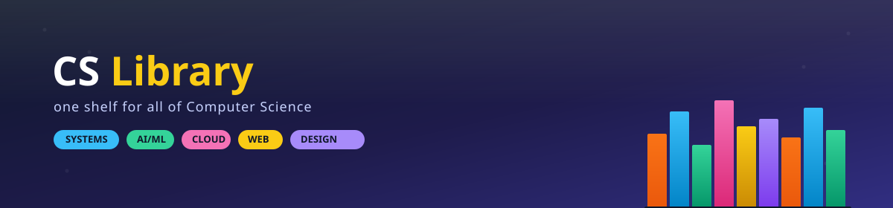

<div align="center">




*A single, well-organized home for the books that make up a solid CS education —*
*from theory and architecture to modern web development and system design.*

</div>

---

## 📖 About

This repository is a personal library of Computer Science reference books, textbooks, and guides, sorted into topic folders so anything can be found in seconds. It spans core CS theory, systems programming, languages, cloud & DevOps, and modern software engineering practice.

> **Note:** These books are shared for personal, educational use. Please support the authors and publishers by purchasing their work where possible.

### 📊 Collection at a glance

| Topic | | Count |
|---|---|---|
| Web Dev | ▰▰▰▰▰▰▰▰▰▰▰▰▰▰▰ | 15 |
| Software Engineering | ▰▰▰▰▰▰▰▰▰▰▰▰▰ | 13 |
| Cloud Computing | ▰▰▰▰▰▰▰▰ | 8 |
| Linux | ▰▰▰▰▰▰▰▰ | 8 |
| DevOps | ▰▰▰▰▰▰▰ | 7 |
| System Design | ▰▰▰▰▰▰ | 6 |
| AI · Architecture · Golang · Networking | ▰▰▰▰ | 4 each |
| Cryptography · Python | ▰▰▰ | 3 each |
| C · DBMS · Java · OS · Discrete Math | ▰▰ | 2 each |
| Compiler · Rust | ▰ | 1 each |

<sub>Each ▰ ≈ 1 book. Web Dev and Software Engineering are, unsurprisingly, where the shelf sags the most.</sub>

---

<details open>
<summary><h2>🤖 AI </h2></summary>

- [AI Engineering](./AI/AI%20Engineering.pdf)
- [Artificial Intelligence For Dummies](./AI/Artificial%20Intelligence%20For%20Dummies.pdf)
- [Deep Learning (Adaptive Computation and Machine Learning)](./AI/Deep%20Learning%20Adaptive%20Computation%20and%20Machine%20Learning.pdf)
- [Machine Learning Book](./AI/Machine%20Learning%20book.pdf)
</details>

<details>
<summary><h2>🏛️ Architecture </h2></summary>

- [Advanced Computer Architecture: Parallelism](./Architecture/ADVANCED_COMPUTER_ARCHITECTURE_PARALLELI.pdf)
- [Computer Architecture, 6th Edition — A Quantitative Approach](<./Architecture/Computer Architecture, Sixth Edition_ A Quantitative Approach ( PDFDrive ).pdf>)
- [Computer Architecture — Hwang & Briggs](./Architecture/Computer_architecture_hwang_brigg.pdf)
- [Computer System Architecture — M. Morris Mano](./Architecture/mano-m-m-computer-system-architecture.pdf)
</details>

<details>
<summary><h2>🔤 C </h2></summary>

- [The C Book](./C/C-book.pdf)
- [Programming in ANSI C — E. Balagurusamy](<./C/Programming in ANSI C (E Balagurusamy).pdf>)
</details>

<details>
<summary><h2>🔐 Cryptography </h2></summary>

- [Cryptography and Network Security — Atul Kahate](./CRYPTOGRAPHY/Atul_kahate.pdf)
- [Cryptography and Network Security — Forouzan](./CRYPTOGRAPHY/Forouzan.pdf)
- [Cryptography and Network Security — William Stallings](./CRYPTOGRAPHY/WilliamStallings.pdf)
</details>

<details>
<summary><h2>☁️ Cloud Computing </h2></summary>

- [Amazon Web Services in Action](<./Cloud Computing/Amazon Web Services in Action.pdf>)
- [Cloud Computing: Principles and Paradigms](<./Cloud Computing/CLOUD COMPUTING Principles and Paradigms.pdf>)
- [Cloud Computing: Concepts, Technology, Security, and Architecture](<./Cloud Computing/Cloud Computing_ Concepts, Technology, Security, and Architecture (The Pearson Digital Enterprise...{Thomas Erl, Eric Monroy}(2023, Pearson).pdf>)
- [Cloud Computing: Theory and Practice](<./Cloud Computing/Cloud-Computing-Theory-and-Practice.pdf>)
- [Handbook of Cloud Computing](<./Cloud Computing/Handbook_of_Cloud_Computing.pdf>)
- [Mastering Cloud Computing — Foundations and Applications Programming (Rajkumar Buyya, 2nd Ed.)](<./Cloud Computing/Mastering Cloud Computing Foundations and Applications Programming (Rajkumar Buyya)_2nd_Edition.pdf>)
- [Cloud Computing for Dummies (2nd Ed.)](<./Cloud Computing/cloud-computing-for-dummies-2ed_compress.pdf>)
- [The Self-Taught Cloud Computing Engineer](<./Cloud Computing/the-self-taught-cloud-computing-engineer.pdf>)
</details>

<details>
<summary><h2>⚙️ Compiler </h2></summary>

- [Compilers: Principles, Techniques, and Tools (2nd Ed.) — Aho](<./Compiler/Aho - Compilers - Principles, Techniques, and Tools 2e-1.pdf>)
</details>

<details>
<summary><h2>🗄️ DBMS </h2></summary>

- [Fundamentals of Database Systems](<./DBMS/Fundamentals of Database Systems.pdf>)
- [Database Systems: A Practical Approach to Design, Implementation and Management (6th Global Ed.)](<./DBMS/Pearson.Database.Systems.A.Practical.Approach.to.Design.Implementation.and.Management.6th.Global.Edition.pdf>)
</details>

<details>
<summary><h2>🔁 DevOps </h2></summary>

- [Accelerate — Building and Scaling High Performing Technology Organisations](<./DevOps/Accelerate - Building and Scaling High Performing Technology Organisations - Nicole Fergrson.pdf>)
- [Site Reliability Engineering](<./DevOps/Site Reliability Engineering.pdf>)
- [The DevOps Engineer's Career Guide](<./DevOps/The DevOps Engineer’s Career Guide A Handbook for Entry- Level Professionals to get into Continuous Delivery Roles for Agile... (Stephen Fleming).pdf>)
- [The DevOps Handbook](<./DevOps/The DevOps Handbook.pdf>)
- [The Linux DevOps Handbook](<./DevOps/The Linux DevOps Handbook.pdf>)
- [The Phoenix Project](<./DevOps/The Phoenix Project.pdf>)
- [The Unicorn Project](<./DevOps/The Unicorn Project.pdf>)
</details>

<details>
<summary><h2>➗ Discrete Mathematics </h2></summary>

- [Discrete Mathematics](<./Discrete Mathemaics/DiscreteMathematics.pdf>)
- [Graph Theory with Applications to Engineering](<./Discrete Mathemaics/Graph_Theory_With_Applications_To_Engine.pdf>)
</details>

<details>
<summary><h2>🐹 Golang </h2></summary>

- [Go: Building Web Applications](<./Golang/Go building web application.pdf>)
- [The Go Bible](<./Golang/Go_byble_book.pdf>)
- [Go Book](./Golang/gobook.pdf)
- [Network Programming with Go](<./Golang/network-programming-with-go-learn-to-code-secure-and-reliable-network-services-from-scratch-1nbsped-1718500882-9781718500884-9781718500891_compress.pdf>)
</details>

<details>
<summary><h2>☕ Java </h2></summary>

- [Effective Java](<./JAVA/Effective Java.pdf>)
- [Java: The Complete Reference](<./JAVA/Java the Complete Reference.pdf>)
</details>

<details>
<summary><h2>🐧 Linux </h2></summary>

- [How Linux Works: What Every Superuser Should Know](<./LINUX/HOW LINUX WORKS WHAT EVERY SUPERUSER SHOULD KNOW.pdf>)
- [Learning Modern Linux](<./LINUX/Learning Modern Linux .pdf>)
- [Linux Pocket Guide (2nd Ed.)](<./LINUX/Linux Pocket Guide, 2nd Edition.pdf>)
- [Linux: The Complete Reference](<./LINUX/Linux _ the complete reference.pdf>)
- [The Linux Command Line](<./LINUX/The Linux CommandLine.pdf>)
- [The Linux Programming Interface](<./LINUX/The Linux Programming Interface.pdf>)
- [The UNIX Programming Environment](<./LINUX/The UNIX Programming Environment.pdf>)
- [Your UNIX/Linux: The Ultimate Guide (3rd Ed.)](<./LINUX/Your UNIX Linux - The Ultimate Guide - Third Edition.pdf>)
</details>

<details>
<summary><h2>🌐 Networking </h2></summary>

- [Data Communications and Networking — Forouzan](<./Networking/(McGraw-Hill Forouzan Networking) Behrouz A. Forouzan - Data Communications and Networking -McGraw-Hill Higher Education (2007).pdf>)
- [The HTTP Book](./Networking/HTTP_book.pdf)
- [TCP/IP for Dummies](<./Networking/TCP-IP For Dummies.pdf>)
- [TCP/IP Protocol Suite (4th Ed.) — Forouzan](<./Networking/tcp_ip-protocol-suite-4th-ed-b-forouzan-mcgraw-hill-2010-bbs.pdf>)
</details>

<details>
<summary><h2>🖥️ OS </h2></summary>

- [Operating System Concepts (9th Ed.) — Silberschatz](<./OS/Abraham Silberschatz-Operating System Concepts (9th,2012_12).pdf>)
- [Distributed Operating Systems: Concepts and Design — Sinha](<./OS/Pradeep K. Sinha - Distributed Operating Systems_ Concepts and Design-Wiley-IEEE Press (1996).pdf>)
</details>

<details>
<summary><h2>🐍 Python </h2></summary>

- [Introduction to Python Programming](<./Python/Introduction_to_Python_Programming.pdf>)
- [Learning Python](./Python/Learning_Python.pdf)
- [Python for Data Analysis](<./Python/Python-for-Data-Analysis.pdf>)
</details>

<details>
<summary><h2>🦀 Rust </h2></summary>

- [The Rust Book](./RUST/The_Rust_Book.pdf)
</details>

<details>
<summary><h2>🛠️ Software Engineering </h2></summary>

- [Algorithms — Illustrated](<./Software Engineering/Algorithms - Illustrated Programmers Curious.pdf>)
- [Clean Code: A Handbook of Agile Software Craftsmanship](<./Software Engineering/Clean Code A Handbook of Agile Software Craftsmanship.pdf>)
- [Code Complete](<./Software Engineering/Code Complete.pdf>)
- [Platform Engineering — Fournier & Nowland](<./Software Engineering/Platform Engineering_ A Guide for Technical, Product, and -- Camille Fournier, Ian Nowland -- 1, 2024 -- O'Reilly Media, Incorporated -- isbn13 9781098153649 -- 7d6fd235c47e0f61791d02f580e5f496 -- Anna’s Archive.pdf>)
- [Staff Engineering](<./Software Engineering/Staff Engineering.pdf>)
- [The Pragmatic Programmer (20th Anniversary Ed.)](<./Software Engineering/The Pragmatic Programmer Your Journey to Mastery, 20th Anniversary Edition by Andrew Hunt David Hurst Thomas.pdf>)
- [The Staff Engineer's Path — Tanya Reilly](<./Software Engineering/The Staff Engineer’s Path -- Tanya Reilly.pdf>)
- [Think Like a Programmer](<./Software Engineering/Think Like a Programmer - An Introduction to Creative Problem Solving.pdf>)
- [Designing Data-Intensive Applications](<./Software Engineering/designing-data-intensive-applications-the-big-ideas-behind-reliable-scalable-and-maintainable-systems-2_compress.pdf>)
- [Designing Distributed Systems](<./Software Engineering/designing-distributed-systems-patterns-and-paradigms-for-scalable-reliable-services-first-edition.pdf>)
- [Fundamentals of Software Engineering: From Coder to Engineer](<./Software Engineering/fundamentals-of-software-engineering-from-coder-to-engineer.pdf>)
- [Head First Software Development](<./Software Engineering/head_first_software_development.pdf>)
- [Software Engineering at Google](<./Software Engineering/software-engineering-at-google-lessons-learned-from-programming-over-time-1nbsped-1492082791-9781492082798_compress.pdf>)
</details>

<details>
<summary><h2>🏗️ System Design </h2></summary>

- [System Design Interview — Alex Xu](<./System Design/10-1 System Design Inteview by Alex xu.pdf>)
- [System Design Interview, Vol. 2 — Alex Xu](<./System Design/10-2 System_Design_Interview Guides_Alex_Xu_Vol2.pdf>)
- [ByteByteGo: Big Archive of System Design](<./System Design/10-3 Bytebytego_Big_Archive_System_Design_2023.pdf>)
- [Cracking the Coding Interview (6th Ed.)](<./System Design/Cracking-the-Coding-Interview-6th-Edition-189-Programming-Questions-and-Solutions.pdf>)
- [Domain-Driven Design: Tackling Complexity in the Heart of Software](<./System Design/Domain Driven Design - Tackling Complexity in the Heart of Software.pdf>)
- [Hands-On Microservices with Kubernetes](<./System Design/Hands On Microservices With Kubernetes - Build deploy and manage scalable microservices on-kubernetes.pdf>)
</details>

<details>
<summary><h2>🕸️ Web Dev </h2></summary>

- [Eloquent JavaScript (3rd Ed.)](<./Web Dev/Eloquent_JavaScript_3rdEdition.pdf>)
- [Head First JavaScript Programming](<./Web Dev/Head First JavaScript Programming.pdf>)
- [Learning TypeScript](<./Web Dev/Learning TypeScript.pdf>)
- [JavaScript: The Good Parts](<./Web Dev/OReilly_JavaScript_The_Good_Parts_May_2008.pdf>)
- [Mastering Node.js](<./Web Dev/PP.Mastering.Node.js.Nov.2013.www.EBooksWorld.ir.pdf>)
- [Pro TypeScript (2nd Ed.)](<./Web Dev/Pro_TypeScript_2nd.www.EBooksWorld.ir.pdf>)
- [The Road to React — Robin Wieruch](<./Web Dev/Robin Wieruch - The Road to React.pdf>)
- [Web Development with Node & Express](<./Web Dev/Web_Development_with_Node_Express.pdf>)
- [JavaScript](./Web%20Dev/javascript.pdf)
- [Learning Node.js Development](<./Web Dev/learning-nodejs-development.pdf>)
- [Learning React: Modern Patterns for Developing React Apps](<./Web Dev/learning-react-modern-patterns-for-developing-react-apps-2nbsped-1492051721-9781492051725_compress.pdf>)
- [Mastering API Architecture](<./Web Dev/mastering-api-architecture.pdf>)
- [React](./Web%20Dev/react.pdf)
- [HTML & CSS: The Complete Reference (5th Ed.)](<./Web Dev/the-complete-reference-html-css-fifth-edition.pdf>)
- [The Ultimate TypeScript Handbook](<./Web Dev/ultimate-typescript-handbook-build-scale-and-maintain-modern-web-applications-with-typescript-9789388590785.pdf>)
</details>

---

## 🗂️ Repository Structure

```
.
├── AI/
├── Architecture/
├── C/
├── CRYPTOGRAPHY/
├── Cloud Computing/
├── Compiler/
├── DBMS/
├── DevOps/
├── Discrete Mathemaics/
├── Golang/
├── JAVA/
├── LINUX/
├── Networking/
├── OS/
├── Python/
├── RUST/
├── Software Engineering/
├── System Design/
└── Web Dev/
```

## 🤝 Contributing

Additions are welcome! To add a book:

1. Fork the repo and drop the file into the matching topic folder (or open an issue if a new topic is needed).
2. Use a clean, descriptive filename — e.g. `Author - Title (Edition).pdf`.
3. Update this README's table for that section.
4. Open a pull request.

## ⚠️ Disclaimer

All books listed here belong to their respective authors and publishers. This repository exists purely for personal reference and educational purposes. If you enjoy or benefit from any of these works, please consider buying a copy to support the people who wrote them.

## 📄 License

This repository's organization and README are shared under the [MIT License](LICENSE). The books themselves retain their original copyrights.

---

<div align="center">

Made with ☕ and a love of reading

</div>
